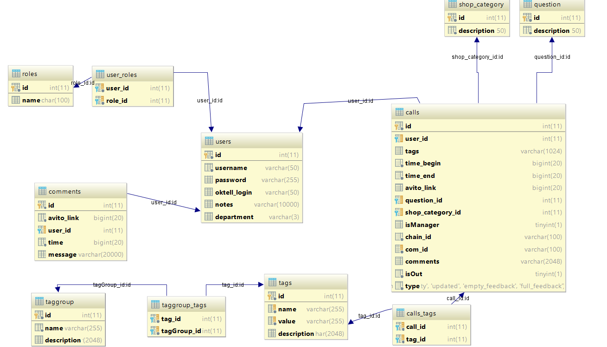

# db
База данных состоит из (на 10.07.17) из 11 таблиц, 3 из которых связующие (user_roles, taggroup_tags и calls_tags). Список:
1. [calls](db.md#calls)  
2. *[calls_tags](db.md#calls_tags)*
3. [comments](db.md#comments)  
4. [question](db.md#question)
5. [roles](db.md#roles)
6. [shop_category](db.md#shop_category)
7. [taggroup](db.md#shop_category)
8. *[taggroup_tags](db.md#taggroup_tags)*
9. [tags](db.md#tags)
10. *[user_roles](db.md#user_roles)*
11. [users](db.md#users)

___
## ER модель

___
## Таблицы
### calls
Основная, собственно, таблица. Хранит в себе информацию о звонках.
#### Поля
1. id - **Primary Key**, int, id звонка, autoincrement.
2. user_id - **Foreign Key -> users(id)**, int, id агента поддержки, составной ключ, индекс
3. tags - varchar(1024), раньше использовался для тэгов, сейчас пустует
4. time_begin - **not null**, bigint, начало времени звонка, unix_time*1000, в мс
5. time_end - **not null**, bigint,  окончание времени звонка, unix_time*1000, в мс
6. avito_link - bigint, номер учетной записи пользователя
7. question_id - **Foreign Key -> question(id)**, int, id вопроса звонка, индекс  
8. shop_category_id - **Foreign Key -> shop_category(id)**, int, id категории учетной записи пользователя, индекс
9. isManager - tinyint(1) ~~ boolean, default 0, от менеджера ли звонок
10. chain_id - **not null**, varchar(100), id цепочки с коммутациями
11. com_id - **not null, UNIQUE**, varchar(100), id коммутации
12. comments - varchar(2048), комментарии к звонку
13. isOut - **not null**, tinyint(1), default 0, исходящий ли звонок.
14. type - **not null**, enum(EMPTY, UPDATED, EMPTY_FEEDBACK, FULL_FEEDBACK), тип звонка.

___
## calls_tags
Связующая таблица для звонков и тэгов, связь многие ко многим.
Поля:
1. call_id - **Foreign Key -> calls(id), not null**, int, id звонка
2. tag_id - **Foreign Key -> tags(id), not null**, int, id тэга, индекс
3. Составной ключ (call_id, tag_id) - **UNIQUE**

___
## comments
Таблица для хранения комментария к учетной записи.
Поля:
1. id - **Primary Key**, int, id комментария
2. avito_link - **not null**, bigint, номер пользователя
3. user_id - **Foreign Key -> users(id)**, int, id агента поддержки, индекс
4. time - **not null**, bigint, время комментария
5. message - varchar(2000), сообщение.

___
## question
Таблица для значений вопросов пользователей, очень небольшая.
Поля:
1. id  - **Primary Key**, int, id вопроса
2. description - **not null**, varchar(150), описание вопроса

___
## roles
Таблица для значений ролей пользователей, очень небольшая.
Поля:
1. id  - **Primary Key**, int, id роли
2. name - **not null**, varchar(100), название роли

___
## shop_category
Таблица для значений вертикалей магазинов
Поля:
1. id  - **Primary Key**, int, id вертикали
2. description - **not null**, varchar(150), название роли

___
## taggroup
Таблица для групп тэгов
Поля:
1. id  - **Primary Key**, int, id группы
2. name - **not null**, varchar(255), название группы
3. description - varchar(2048), более развернутое описание группы 

___
## taggroup_tags
Связующая таблица для групп и тэгов, связь один ко многим. Группа тэгов может быть у "многих" тэгов, тэг может быть у "одной" группы.
Поля:
1. tag_id - **Foreign Key -> tags(id), not null**, int, id звонка
2. tagGroup_id - **Foreign Key -> taggroup(id), not null**, int, id тэга, индекс
3. Составной ключ (taggroup_id, tag_id) - **UNIQUE**

___
## tags
Таблица для тэгов
Поля:
1. id  - **Primary Key**, int, id тэга
2. name - **not null, UNIQUE**, varchar(255), полное название тэга
3. value -  **not null, UNIQUE**, varchar(255), краткий тэг (*listing fees -> lf*)
4. description - varchar(2048), более развернутое описание тэга 

___
## user_roles
Связующая таблица для агентов и ролей, связь один ко многим. Роль может быть у "многих" агентов, агент может быть "одной" роли.
Поля:
1. user_id - **Foreign Key -> users(id), not null**, int, id агента
2. role_id - **Foreign Key -> roles(id), not null**, int, id роли, индекс
3. Составной ключ (user_id, role_id) - **UNIQUE**

___
## users
Таблица с информацией об агентах
Поля:
1. id - **Primary Key**, int, id агента
2. username - **not null**, varchar(50), логин для входа, как в админке
3. password - varchar(255), default *test*, пароль для входа
4. oktell_login - varchar(50), логин из октелла
5. notes - varchar(10000), заметки
6. department - varchar(3), default pro, название департамента.